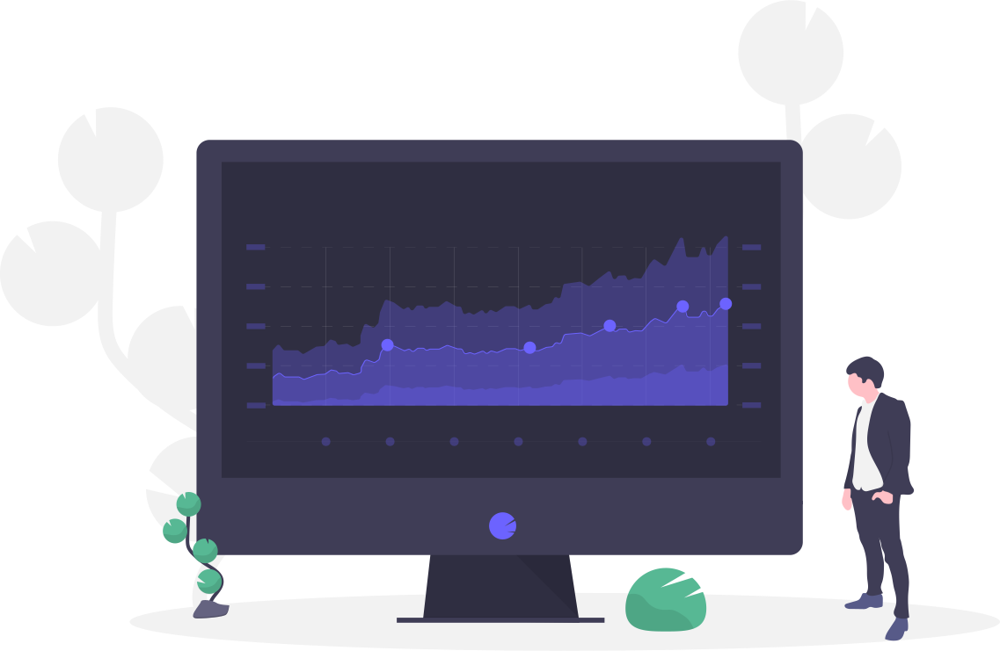

 
<h1>Dummy Dashboard</h1>

Simple Dummy Dashboard for monitoring in Vue

  
  ## About
  
  
  
  This is project is Simple Dummy Dashboard for monitoring in Vue.
  
A dashboard is a visual display of all of your data. While it can be used in all kinds of different ways, its primary intention is to provide information at-a-glance, such as KPIs. A dashboard usually sits on its own page and receives information from a linked database.
  
  ## Deployed
  
  
  
  ## License
  [MIT](https://github.com/vibgreon/K8s-goTODO/blob/main/LICENSE)
